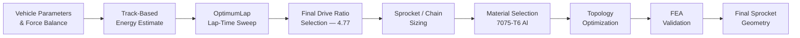

# Chain Drive System – Design & Development
### Formula Student Electric Vehicle (FSEV) · Powertrain Sub-system

## Overview

This repo documents the design of the **chain drive system** for the IITG Racing Formula Bharat electric vehicle — from final-drive ratio selection through to **topology-optimization-based weight reduction** of the driven sprocket, validated by FEA.

| | |
|---|---|
| **Author** | K Aravindhan — Lead Engineer, Powertrain & Transmission |
| **Team** | IITG Racing – Formula Bharat |
| **Tools** | OptimumLap (lap simulation) · Ansys Mechanical 2025 R2 (FEA + Topology Optimization) |
| **Result** | 41% mass reduction on the driven sprocket (0.893 kg → 0.527 kg) |

---

## 📑 Contents

- [Design Targets](#design-targets)
- [Chain Drive Specification](#chain-drive-specification)
- [Methodology](#methodology)
- [Topology Optimization](#topology-optimization)
- [FEA Validation](#fea-validation)
- [Results Summary](#results-summary)
- [Notes & Recommendations](#notes--recommendations)
- [References](#references)

---

## Design Targets

| Target | Value |
|---|---|
| 0–100 km/h | 3–5 s |
| Maximum speed | 110–125 km/h |
| Vehicle mass | 305 kg |
| Drag coefficient (Cd) | 1.187 |
| Wheel diameter | 45.72 cm (18″) |

Longitudinal load equation used for sizing:

```
F = m·a + ½·Cd·ρ·A·v² + Cr·W·cosθ + W·sinθ
```

---

## Chain Drive Specification

| Parameter | Value |
|---|---|
| **Final drive ratio** | 4.77 target → **4.79** actual |
| **Driver sprocket** | 14T · 201 annealed stainless steel |
| **Driven sprocket** | 67T · 7075-T6 aluminium alloy |
| **Chain** | 06B1 simplex roller chain (3/8″ pitch) |
| **Simulated top speed** | ≈ 70 km/h |
| **Simulated lap time** | 66.54 s |
| **Energy / lap · 22-lap endurance** | 0.135 kWh · 2.97 kWh |

---

## Methodology



A final drive ratio sweep of 1.0–10.0 was run in OptimumLap against the Formula Bharat endurance track (3 straights, 2× 4 m-radius hairpins). Minimum lap time occurred between **4.5–6.5**; **4.77** was chosen as the best compromise between acceleration and top speed.

---

## Topology Optimization

The driven sprocket (7075-T6 aluminium) was optimized in **Ansys Mechanical** to cut unnecessary mass from its web while preserving the tooth profile, bore, and bolt-circle.

| Setting | Value |
|---|---|
| Optimization type | Topology Optimization – Mixable Density |
| Objective | Minimize compliance (maximize stiffness) |
| Mass constraint | Retain 60% of original mass |
| Symmetry | 8-sector cyclic symmetry about X-axis |
| Excluded faces | 443 (tooth profile, bore, bolt-circle) |
| Converged at | Iteration 23 / 500 max |

---

## FEA Validation

A static structural baseline run (Structural Steel properties, 667.8 N·m ramped moment) confirmed margin before optimization:

| Result | Value |
|---|---|
| Max. equivalent (von Mises) stress | 79.16 MPa |
| Avg. equivalent stress | 5.51 MPa |
| Max. total deformation | 1.09 × 10⁻² mm |
| **Factor of safety** (vs. 250 MPa yield) | **≈ 3.16** |

---

## Results Summary

| Quantity | Before | After | Change |
|---|---|---|---|
| Driven sprocket mass | 0.893 kg | **0.527 kg** | **−41%** |
| Volume | 1.138 × 10⁻⁴ m³ | 6.716 × 10⁻⁵ m³ | −41% |
| Mass retained vs. 60% target | — | 59.01% | within 1% of target |

---

---
